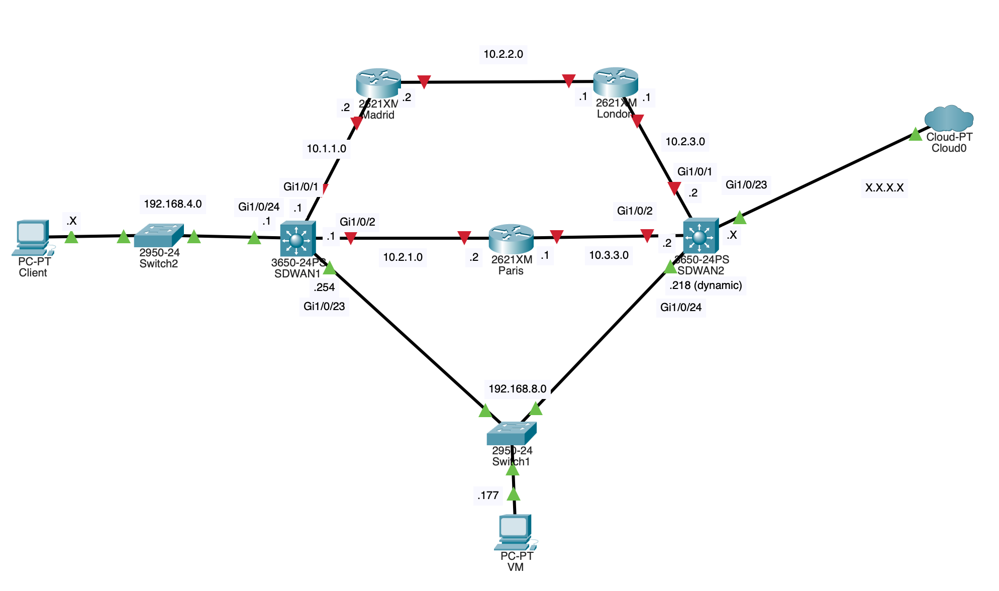

# NetPBR

## For Developer

### Install dependancies
    pip3 install -r requirement.txt

### 
### Setup Access-control list & PBR
    set_ACL(cisco_addr_src, cisco_mask_src, cisco_addr_dest, cisco_mask_dest, nb_ACL, sdw_connect, port=-1):

    unset_ACL(sdw_connect, nb_ACL):

    set_PBR(sdw_connect, cisco_interface, name_pbr, nb_ACL, addr_route):

    unset_PBR(sdw_connect : ConnectHandler, cisco_interface, name_pbr, nb_ACL, addr_route):

### Get informations about cisco router
    get_int(cisco_name, cisco_interface, sdw_connect):

    get_latency(cisco_name, cisco_addr_src, cisco_addr_dest, sdw_connect):

## In Development
TODO :
 - [ ] support case where ping failed
 - [ ] support case where connexion failed
 - [ ] test PBR
 - [X] TCPlatency