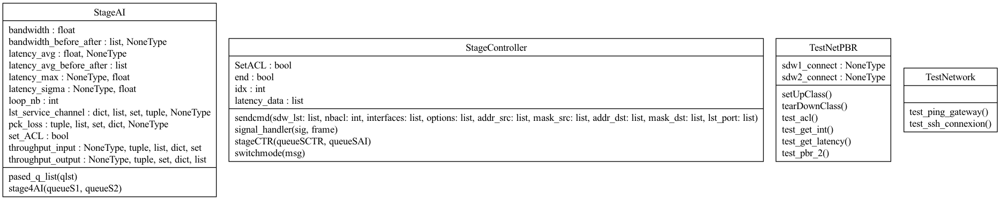
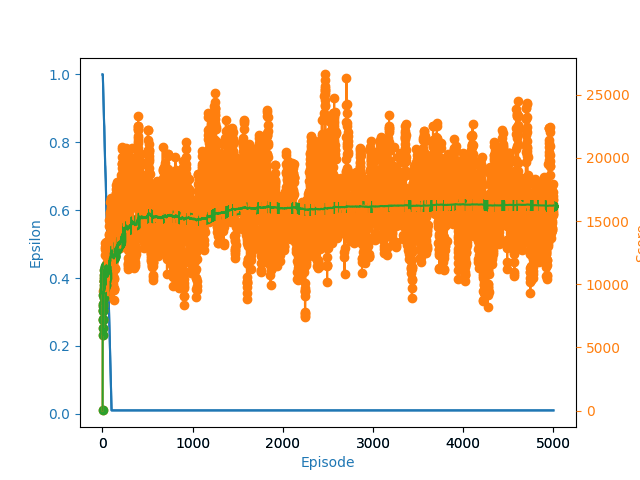

# NetPBR

## For User
### Install dependancies
- You have to compile abing (https://github.com/RichardWithnell/abing) and move binaries to /src/libs
```sh
python3.11 -m pip install -r requirement.txt
```

### Use
- Launch NetPBR Application with the following command :

```sh
python3.11 src/App.py
```

## For Developer


Warning : All theses IP are private IP so you need to set IP in setting of the application according to your network

### Code Analysis

    pyflakes src/*.py
    pylint --disable=C0200,C0301,C0325 src/*.py


### Diagram




### AI Input

- throughput (bit/s, from Cisco switch)
- pck_loss (%, from Cisco switch)
- latency_avg (from abing)
- latency_sigma (from abing)
- latency_max (from abing)
- Available_Bandwidth : bandwidth (from abing)

## In Development
TODO :
 - [ ] test PBR
 - [ ] fetch list of services use by interface (??)
 - [ ] Waiting function between AI and Controller

## AI
### Code Structure

The code is divided into two main parts:

1. **src/SDWANEnv.py**: This file contains a custom Gym environment for simulating an SDWAN (Software-Defined Wide Area Network) environment. The Gym environment is used to create a learning environment compatible with the OpenAI Gym library. It simulates network states such as the current bandwidth, latency, the flow type. The two available actions are using the MPLS link or the internet. To minimize the usage of the MPLS link, a penalty is added to each usage in the environment's reward function. The Gym environment generate random statistics in the initisalization. The changes in the states will depend on the flow type and the action. the gym environnement allow the developer to define the reward function. In our case the reward function will take in consideration the flow type and also the link used

2. **src/DQN.py**: This file contains the `DeepQNetwork` class, which represents the neural network used to estimate the Q-function. The neural network is built using linear layers and utilizes the PyTorch library. It takes network states as input and produces Q-value estimations for each possible action and the `Agent` class, representing the learning agent that utilizes the neural network to make decisions and learn from experience. The agent employs the DQN algorithm with transition memories, an exploration/exploitation policy, and updates the network weights through reinforcement learning.


### Result





Blue : epsilon value in every episode (exploration frequency/exploitation frequency)

Oranges: scores in every episode (rewards)

Green: Avg score in every episode

#### Comment

- The epsilon decrease to favorize the exploitation
- The avg reward increase and converge. that shows that our RL is improving our statistics
