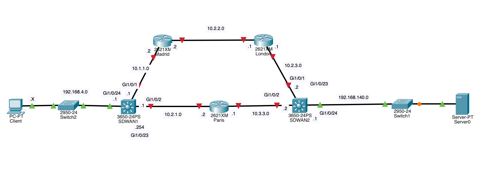

# NetPBR

## For User
Launch NetPBR Application with the following command :
    python3.11 src/App.py

## For Developer

Warning : replace XXX.XXX.104.1 -> XXX.XXX.50.1

### Code Analysis

    pyflakes src/*.py
    pylint --disable=C0200 src/*.py

### Install dependancies
    pip3 install -r requirement.txt

### Diagram

### AI Input

- lst_service_channel (??)
- throughput (bit/s)
- pck_loss (%)
- latency_avg (tcp-latency)
- latency_sigma (tcp-latency)
- latency_max (tcp-latency)
- Available_Bandwidth : bandwidth (abing)

## In Development
TODO :
 - [X] support case where connexion failed
 - [ ] test PBR
 - [X] TCPlatency